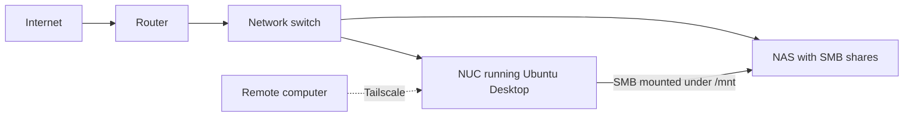

This is the standard operating procedure I followed to turn a Windows NUC into
an Ubuntu Desktop homelab machine. The goal was simple: let the NUC do the
computing, keep the files on the NAS, connect both machines over Ethernet, and
use Tailscale when I needed to reach the NUC from outside the house.

## The finished layout



The important detail is that the NUC and NAS both connect directly to the
network switch. Wi-Fi is not part of the path between the applications and
their storage.

## Before starting

- Back up anything worth keeping from Windows. Installing Ubuntu with the
  **Erase disk** option removes Windows and all local files.
- Download the current Ubuntu Desktop LTS image from
  [Ubuntu](https://ubuntu.com/download/desktop).
- Create a bootable USB drive. Ubuntu's
  [installation guide](https://ubuntu.com/desktop/docs/en/latest/tutorial/install-ubuntu-desktop/)
  covers the complete process.
- Record the NAS address, SMB share names, and the username that has permission
  to access them.
- Have two Ethernet cables available: one for the NAS and one for the NUC.

The examples below use `nas.local`, `media`, `photos`, and `YOUR_USER` as
placeholders. I replaced those values with the actual NAS hostname, share
names, and Ubuntu username on my network.

## 1. Replace Windows with Ubuntu Desktop

1. Insert the Ubuntu USB drive and restart the NUC.
2. Open the NUC boot menu and choose the USB drive.
3. Select **Install Ubuntu**.
4. When the installer reaches disk setup, choose **Erase disk and install
   Ubuntu**. This is the point where Windows is removed.
5. Create the local user account and give the NUC a recognizable hostname.
6. Finish the installation, remove the USB drive, and reboot.

After the first login, I updated the system:

```bash
sudo apt update
sudo apt upgrade
sudo reboot
```

I then confirmed the NUC could see its Ethernet interface and local IP address:

```bash
ip -brief address
```

## 2. Hard-wire the NUC and NAS

I connected the network in this order:

1. Router or gateway to the network switch.
2. NAS Ethernet port to the switch.
3. NUC Ethernet port to the same switch.

I disabled Wi-Fi on the NUC after confirming Ethernet worked. That made it
clear that file traffic between the NUC and NAS was using the wired network.

These checks confirmed the link and NAS connectivity:

```bash
ip -brief link
ping -c 4 nas.local
```

For a dependable setup, I also reserved stable local IP addresses for the NUC
and NAS in the router's DHCP settings. A reservation avoids hard-coding network
settings on each device while keeping their addresses predictable.

## 3. Create SMB shares on the NAS

In the NAS administration interface, I:

1. Enabled the SMB file service.
2. Created the folders I wanted the NUC to use, including the media and photo
   libraries.
3. Published each folder as an SMB share.
4. Created or selected a dedicated NAS user for the NUC.
5. Granted that user read/write access only to the required shares.

Before making the mounts permanent, I confirmed the username and password could
open each share from another computer. This separated NAS permission problems
from Ubuntu mount problems.

## 4. Mount the NAS shares under `/mnt`

Ubuntu needs the CIFS utilities to mount SMB shares:

```bash
sudo apt install cifs-utils
```

I created one local mount point for each NAS share:

```bash
sudo mkdir -p /mnt/nas-media
sudo mkdir -p /mnt/nas-photos
```

Next, I stored the NAS credentials in a root-only file instead of putting the
password directly in `/etc/fstab`:

```bash
sudo mkdir -p /etc/samba
sudo nano /etc/samba/nas-credentials
```

The credentials file contains:

```ini
username=NAS_USERNAME
password=NAS_PASSWORD
```

I then restricted the file:

```bash
sudo chmod 600 /etc/samba/nas-credentials
```

I found my Ubuntu numeric user and group IDs with:

```bash
id YOUR_USER
```

Then I added the shares to `/etc/fstab`:

```bash
sudo nano /etc/fstab
```

Example entries:

```text
//nas.local/media /mnt/nas-media cifs credentials=/etc/samba/nas-credentials,uid=1000,gid=1000,iocharset=utf8,_netdev,nofail,x-systemd.automount 0 0
//nas.local/photos /mnt/nas-photos cifs credentials=/etc/samba/nas-credentials,uid=1000,gid=1000,iocharset=utf8,_netdev,nofail,x-systemd.automount 0 0
```

`uid` and `gid` must match the values returned for the Ubuntu user. `_netdev`
tells the system that these mounts depend on the network, `nofail` prevents an
unavailable NAS from stopping startup, and `x-systemd.automount` mounts a share
when it is first accessed.

I tested the configuration before rebooting:

```bash
sudo mount -a
ls -la /mnt/nas-media
ls -la /mnt/nas-photos
findmnt -t cifs
```

If `sudo mount -a` reports an error, I fix it before restarting. A typo in
`/etc/fstab` is much easier to diagnose while the current session is still
open.

## 5. Install Tailscale for remote access

I installed Tailscale using its
[official Linux instructions](https://tailscale.com/docs/install/linux):

```bash
curl -fsSL https://tailscale.com/install.sh | sh
sudo tailscale up
```

`tailscale up` printed an authentication URL. I opened it, signed in, and added
the NUC to my tailnet. I then checked the connection:

```bash
tailscale status
tailscale ip
```

I installed Tailscale on the computer or phone I planned to use remotely and
signed in to the same tailnet. This gave me private access to the NUC without
forwarding a management port through the home router.

Tailscale access and SMB storage solve different problems. Tailscale provides
the remote path to the NUC; the NUC still reaches the NAS over the local,
hard-wired Ethernet connection.

## 6. Final verification

I considered the setup complete only after this restart test:

1. Restart the NAS and wait for it to become available.
2. Restart the NUC.
3. Confirm the NUC is using Ethernet.
4. Open files from each directory under `/mnt`.
5. Create and delete a test file to confirm the intended write permissions.
6. Run `findmnt -t cifs` and verify every SMB share is mounted.
7. Run `tailscale status` and verify the NUC is connected.
8. Disconnect the remote computer from the home network and confirm it can
   still reach the NUC over Tailscale.

At that point the roles were cleanly separated: Ubuntu and the applications
run on the NUC, bulk storage stays on the NAS, the switch carries local traffic,
and Tailscale provides remote access.
