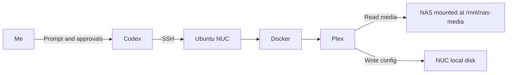

I set up the physical NUC and replaced Windows with Ubuntu myself. Once the
machine was on the network and the NAS shares were mounted, I used Codex for
the Docker work.

That is worth saying plainly. Installing Docker is not especially difficult,
but copying repository keys, checking package names, writing Compose files,
fixing permissions, and verifying services can get tedious. Codex connected to
the NUC over SSH, ran the installation commands, created the Plex configuration,
and checked the result. I still reviewed the commands and approved privileged
actions.

This post records the same process as a repeatable SOP.

## The plan



The split between storage locations is intentional:

- Movies and shows stay on the NAS and appear on the NUC under
  `/mnt/nas-media`.
- Plex configuration and its database stay on the NUC's local disk.
- Docker manages the Plex process and makes the setup easy to recreate.

Plex warns that its `/config` directory needs a filesystem with reliable file
locking. I did not place that directory on the SMB share. Only the media library
comes from the NAS.

## Before starting

This SOP assumes:

- Ubuntu is already running on the NUC.
- The NUC has a wired Ethernet connection.
- The NAS SMB share is already mounted at `/mnt/nas-media`.
- The Ubuntu user can read the media directories.
- SSH key authentication works from the computer running Codex.
- Tailscale is connected on both the NUC and the computer running Codex.

I first confirmed the remote connection myself:

```bash
ssh nuc
```

`nuc` is the host alias in my local `~/.ssh/config`. The `HostName` is the
**Tailscale IP assigned to the NUC**, not its regular address on my home LAN. A
minimal entry looks like:

```text
Host nuc
  HostName NUC_TAILSCALE_IP
  User YOUR_USER
  IdentityFile ~/.ssh/id_ed25519
```

I found that address on the NUC with `tailscale ip -4`. Using the Tailscale IP
means the SSH connection travels through my tailnet and the same alias works
whether my computer is at home or somewhere else. I did not open port 22 or add
an SSH port-forwarding rule on the home router.

I used a normal user with `sudo` access and key authentication. I did not put a
password or private key in the prompt. Codex used the SSH configuration and
credentials already available on my computer.

## What I asked Codex to do

My prompt was specific about the target, storage, and stopping points:

> SSH to the Ubuntu NUC using the `nuc` host alias. Install Docker Engine and
> the Docker Compose plugin from Docker's official Ubuntu repository. Verify
> the installation with `hello-world`. Create a Plex Compose project that keeps
> configuration on the NUC, mounts `/mnt/nas-media` read-only, and uses host
> networking. Show me the Compose file before starting the container. Ask
> before running privileged commands.

This kept Codex focused on one machine and made the important choices visible
before it changed anything.

## 1. Inspect the NUC

Before installing packages, Codex checked the operating system, architecture,
disk space, current Docker packages, and NAS mount:

```bash
cat /etc/os-release
dpkg --print-architecture
df -h
findmnt /mnt/nas-media
docker --version
docker compose version
```

The NAS mount had to work before Plex was started. Otherwise Docker could bind
an empty local directory at the expected path and Plex would appear to have an
empty library.

## 2. Install Docker Engine

I used Docker's
[official Ubuntu repository](https://docs.docker.com/engine/install/ubuntu/)
rather than Ubuntu's similarly named packages.

First, Codex removed packages that could conflict with Docker Engine:

```bash
sudo apt remove docker.io docker-compose docker-compose-v2 docker-doc podman-docker containerd runc
```

It then added Docker's signing key and package repository:

```bash
sudo apt update
sudo apt install -y ca-certificates curl
sudo install -m 0755 -d /etc/apt/keyrings
sudo curl -fsSL https://download.docker.com/linux/ubuntu/gpg \
  -o /etc/apt/keyrings/docker.asc
sudo chmod a+r /etc/apt/keyrings/docker.asc
```

```bash
sudo tee /etc/apt/sources.list.d/docker.sources >/dev/null <<EOF
Types: deb
URIs: https://download.docker.com/linux/ubuntu
Suites: $(. /etc/os-release && echo "${UBUNTU_CODENAME:-$VERSION_CODENAME}")
Components: stable
Architectures: $(dpkg --print-architecture)
Signed-By: /etc/apt/keyrings/docker.asc
EOF
```

Then it installed Docker Engine and the current Compose plugin:

```bash
sudo apt update
sudo apt install -y \
  docker-ce \
  docker-ce-cli \
  containerd.io \
  docker-buildx-plugin \
  docker-compose-plugin
```

## 3. Verify Docker

Codex checked the service before moving on:

```bash
sudo systemctl enable --now docker
sudo systemctl status docker --no-pager
sudo docker run --rm hello-world
sudo docker version
sudo docker compose version
```

I kept `sudo` in the commands. Adding a user to the `docker` group effectively
grants root-level control of the host, so it should be a deliberate decision
rather than a convenience added silently.

## 4. Prepare the Plex directories

I kept the Compose project and Plex database on the NUC:

```bash
sudo mkdir -p /opt/plex/config
sudo mkdir -p /opt/plex/transcode
sudo mkdir -p /opt/plex/compose
sudo chown -R YOUR_USER:YOUR_USER /opt/plex
```

The storage layout was:

| NUC path | Container path | Purpose |
| --- | --- | --- |
| `/opt/plex/config` | `/config` | Plex database and settings |
| `/opt/plex/transcode` | `/transcode` | Temporary transcoding files |
| `/mnt/nas-media` | `/data` | Movies and shows from the NAS |

I verified that the intended user could see the media:

```bash
ls -la /mnt/nas-media
find /mnt/nas-media -maxdepth 2 -type d | head
```

## 5. Create the Plex Compose file

In `/opt/plex/compose/compose.yaml`, Codex created:

```yaml
services:
  plex:
    image: plexinc/pms-docker:latest
    container_name: plex
    network_mode: host
    restart: unless-stopped
    environment:
      TZ: Asia/Seoul
      PLEX_CLAIM: ${PLEX_CLAIM:-}
    volumes:
      - /opt/plex/config:/config
      - /opt/plex/transcode:/transcode
      - /mnt/nas-media:/data:ro
```

This follows the
[official Plex Docker image](https://github.com/plexinc/pms-docker). Host
networking keeps local discovery straightforward, while the read-only media
mount prevents Plex from changing or deleting the source files.

For an Intel NUC with supported hardware transcoding, the container can also
receive the graphics device:

```yaml
    devices:
      - /dev/dri:/dev/dri
```

I only add that after confirming `/dev/dri` exists on the host. Plex hardware
transcoding also requires the appropriate Plex subscription and compatible
hardware.

## 6. Claim and start Plex

For a new server, I generated a short-lived claim token at
[plex.tv/claim](https://www.plex.tv/claim). I passed it for the first start
without saving it in Git:

```bash
cd /opt/plex/compose
read -rsp "Plex claim token: " PLEX_CLAIM
echo
sudo --preserve-env=PLEX_CLAIM docker compose up -d
unset PLEX_CLAIM
```

Claim tokens expire quickly, so I generated the token immediately before
starting the container. After the server was associated with my Plex account,
the environment value was no longer needed.

Codex then verified the deployment:

```bash
sudo docker compose ps
sudo docker compose logs --tail=100 plex
curl -I http://127.0.0.1:32400/web
```

I opened the Plex web interface from another computer on the home network:

```text
http://NUC_IP_ADDRESS:32400/web
```

In the setup wizard, I added libraries using paths inside the container, such
as `/data/Movies` and `/data/TV`, not the NUC's original `/mnt` paths.

## 7. Restart test

A service is not finished just because it works once. I restarted the NUC and
checked the complete chain:

```bash
sudo reboot
```

After reconnecting over SSH:

```bash
findmnt /mnt/nas-media
sudo systemctl is-active docker
sudo docker ps --filter name=plex
curl -I http://127.0.0.1:32400/web
```

The order matters: the NAS share must be mounted, Docker must be active, and the
Plex container must be running. I also played a file from each library to
confirm that Plex could read the actual media rather than only its metadata.

My Apple TV and MKV playback choices are covered separately in
[Apple TV 4K playback with Plex and Infuse](../apple-tv-4k-plex-infuse-playback/).

## Native install or Docker?

Plex can be installed directly on the NUC without Docker. That is a reasonable
choice for a single-purpose machine and can make hardware access feel more
direct.

I chose Docker because the configuration is visible in one file, upgrades are
repeatable, and the application is separated from the base Ubuntu install. The
tradeoff is another layer of paths, permissions, networking, and device access
to understand.

Whichever route I use, the underlying design stays the same: computation on the
NUC, media on the NAS, wired Ethernet between them, and configuration backed up
separately.

## Plex Pass and the Jellyfin alternative

The correct name for Plex's premium offering is
[Plex Pass](https://www.plex.tv/plex-pass/). Plex Media Server works without it,
but some features—including hardware-accelerated transcoding—require Plex Pass.
That matters on a NUC because Intel Quick Sync can reduce the CPU load when Plex
needs to convert video for a client.

[Jellyfin](https://jellyfin.org/) is another option. It is a separate,
open-source media server rather than a Plex add-on, and its official
[container image](https://jellyfin.org/docs/general/installation/container/?method=docker-compose)
can use the same basic Docker design: local configuration on the NUC, media
mounted read-only from the NAS, and optional access to `/dev/dri` for supported
hardware acceleration.

Plex has the ecosystem and client experience I chose for this setup. Jellyfin
is worth evaluating if an open-source stack and avoiding Plex's premium tier
matter more. I would run one first, confirm playback and transcoding on every
important device, and only then decide whether maintaining both is useful.

## The Codex caveat

Codex saved time, but I did not treat it as an unattended root user. SSH and
`sudo` make mistakes more consequential.

My rules were:

1. Use a named SSH host and a least-privilege account.
2. Ask for a plan before allowing changes.
3. Review the Compose file and volume paths before starting containers.
4. Require approval for privileged or destructive commands.
5. Never paste passwords, private keys, or long-lived tokens into a prompt.
6. Test mounts and backups before trusting automation.

Codex handled the tedious execution and verification. I remained responsible
for the architecture, credentials, approvals, and final test.
